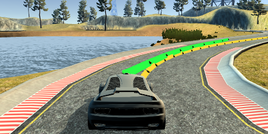
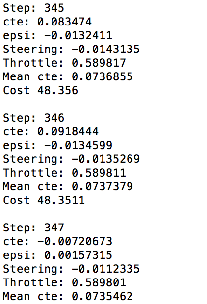

# Lab: Model Predictive Control (MPC)
[](http://www.udacity.com/drive)


## Introduction

`MPC(Model Predictive Control)` is a project of [Udacity's self driving car nanodegree class](https://www.udacity.com/drive). 
The goal of this project is control the vehicle to follow the reference path. 

### Environment of this project

**Software** 
* Ubuntu 16.04 (64bit)

* cmake >= 3.5

* All OSes: [click here for installation instructions](https://cmake.org/install/)

* make >= 4.1

  - Linux: make is installed by default on most Linux distros
  - Mac: [install Xcode command line tools to get make](https://developer.apple.com/xcode/features/)
  - Windows: [Click here for installation instructions](http://gnuwin32.sourceforge.net/packages/make.htm)

* gcc/g++ >= 5.4

  - Linux: gcc / g++ is installed by default on most Linux distros
  - Mac: same deal as make - [install Xcode command line tools]((https://developer.apple.com/xcode/features/)
  - Windows: recommend using [MinGW](http://www.mingw.org/)

* [uWebSockets](https://github.com/uWebSockets/uWebSockets)

  - Run either `./install-mac.sh` or `./install-ubuntu.sh`.

  - If you install from source, checkout to commit `e94b6e1`, i.e.

    ```
    git clone https://github.com/uWebSockets/uWebSockets 
    cd uWebSockets
    git checkout e94b6e1
    ```

    Some function signatures have changed in v0.14.x. See [this PR](https://github.com/udacity/CarND-MPC-Project/pull/3) for more details.

* Simulator. You can download these from the [this page](https://github.com/udacity/self-driving-car-sim/releases) in the classroom.

There's an experimental patch for windows in this [PR](https://github.com/udacity/CarND-PID-Control-Project/pull/3)


**Hardware**

* CPU: Intel(R) Core(TM) i7-4790K CPU @ 4.00GHZ
* GPU: GeForce GTX 1080
* Memory: 8GB


### Basic Build Instructions

1. Clone this repo.
2. Make a build directory: `mkdir build && cd build`
3. Compile: `cmake .. && make`
4. Run it: `./mpc`. 

---

## MPC

### Vehicle Model 

In this project, I built a Kinematic vehicle model. 

Kinematic model is simplification of dynamic model which ignores tire forces, gravity, mass, etc. 

The simplification reduces accuracy, but it makes it more tractable. 


The state of vehicle model is [$x$, $y$, $\psi$, $v$] and actuator (control input) is [$\delta$, $a$]. 

* $x$ :  X position of the vehicle
* $y$ :  Y position of the vehicle
* $\psi$ :  Heading angle
* $v$ :  Velocity
* $\delta$ :  steering wheel angle
* $a$ :  throttle and brake

Also, the errors such as `Cross Traffic Error` ($cte$) and `Orientation error` ($e{\psi}$) are added as a state. 

* Cross Traffic Error: Distance of vehicle from trajectory
* Orientation Error: Difference of vehicle orientation and trajectory orientation

Therefore, the final state of vehicle is [$x$, $y$, $\psi$, $v$, $cte$, $e\psi$]

Update equation of vehicle state is as follows. 

* $x_{t+1} =x_t +v_t *cos(\psi_t) * dt $
* $y_{t+1} = y_t + v_t * sin(\psi_t) *dt$
* $\psi_{t+1} = \psi_t + (v_t / L_f) * \delta * dt $
* $v_{t+1} = v_t + a_t * dt$
* $cte_{t+1} = f(x_t) - y_t + (v_t * sin(e\psi_t) * dt)$ 
* $e\psi_{t+1} = e\psi_t + (v_t / L_f) * \delta_t * dt$

In the project, reference line is a third order polynomial ( f ) 


### N & dt

At first, I set timestep length(N) and duration (dt) 

```c++
// TODO: Set the timestep length and duration
size_t N = 10;
double dt = 0.1;
```

At the udacity lecture, `T = N * dt`. Also, it said T should be as large as possible, while dt should be as small as possible. 

* Number of Timesteps (N) 
  * The length of control input vector is determined by N
  * $[\delta_1, a_1, \delta_2, a_2, ..., \delta_{N-1}, a_{N-1}]$ 
  * Thus N determines the number of variables which are optimized by MPC.
  * This is also the major driver of computational cost. 
* Timestep Duration (dt)
  * MPC attempts to approximate a continuous reference trajectory by means of discrete paths between actuation.
  * Larger value of dt result less frequent actuations, which makes it harder to accurately approximate a continuous reference trajectory. 
  * This is calssed `Discretization error`


In my case, l set the values about time step is N = 12, dt = 0.05. But 12 * 0.05 =  0.6 is too short. Therefore, I set my final values of N and dt as N = 10 and dt = 0.1 


### Cost Value 

Setting the cost value is as follows.

```c++
// Cost is stored in the first element of 'fg'
fg[0] = 0;

double ref_speed = 65;

double weight_cte  = 0.5;
double weight_epsi = 0.5;
double weight_vel  = 0.1;

double weight_del  = 1;
double weight_acc  = 1;

double weight_del_diff = 10000;
double weight_acc_diff = 0.5;

// The part of the cost based on the refetence state
for (int i = 0; i < N; i++)
{
fg[0] += weight_cte * CppAD::pow(vars[cte_start + i], 2);
fg[0] += weight_epsi * CppAD::pow(vars[epsi_start + i], 2);
fg[0] += weight_vel * CppAD::pow(vars[v_start + i] - ref_speed, 2);
}

// Minimize the use of actuators
for (int i = 0; i < N - 1; i++)
{
fg[0] += weight_del * CppAD::pow(vars[delta_start + i], 2);
fg[0] += weight_acc * CppAD::pow(vars[a_start + i], 2);
}

// Minimize the value gap between sequential actuations
for (int i = 0; i < N - 2; i++)
{
fg[0] += weight_del_diff * CppAD::pow(vars[delta_start + i + 1] - vars[delta_start + i], 2);
fg[0] += weight_acc_diff * CppAD::pow(vars[a_start + i + 1] - vars[a_start + i], 2);
}
```

fg[0] is the cost value. 

I used `reference state` ($cte$, $e\psi$, velocity error), `Use of actuators`, `Value gap between sequential actuations` as cost value. Also, I used weight to each part of cost value to control the importance of the parts of the cost values. 


### Vehicle State Update 

As I mentioned before, the state of vehicles are [$x$, $y$, $\psi$, $v$, $cte$, $e\psi$]. I updated those values as follows. 

```c++
// Calculate values according to the vehicle model
fg[1 + x_start + i] = x_1 - (x_0 + v_0 * CppAD::cos(psi_0) * dt);
fg[1 + y_start + i] = y_1 - (y_0 + v_0 * CppAD::sin(psi_0) * dt);
fg[1 + psi_start + i] = psi_1 - (psi_0 + v_0 * delta_0 / Lf * dt);
fg[1 + v_start + i] = v_1 - (v_0 + a_0 * dt);
fg[1 + cte_start + i] = cte_1 - ((f_0 - y_0) + (v_0 * CppAD::sin(epsi_0) * dt));
fg[1 + epsi_start + i] = epsi_1 - ((psi_0 - psi_des_0) + v_0 * delta_0 / Lf *dt);
```


### Polynomial Fitting

I needed to get coefficient of third order polynomial. 

I got global x, y position of the waypoints as `ptsx` and `ptsy`

At first, I needed to transform these global values to vehicle local coordinate.

The code of global to local transform is as follows. 

```c++
int N_pts = ptsx.size();

VectorXd ptsx_local = VectorXd(N_pts);
ptsx_local.fill(0);

VectorXd ptsy_local = VectorXd(N_pts);
ptsy_local.fill(0);

for (int i = 1; i < N_pts; i++)
{
ptsx_local[i] = (ptsx[i] - px) *  cos(psi) + (ptsy[i] - py) * sin(psi);
ptsy_local[i] = (ptsx[i] - px) * -sin(psi) + (ptsy[i] - py) * cos(psi);
}
```

 With all the local x, y position, I could get coefficient of third order polynomial. 

```c++
// Get polynomial coefficients (Third order)
auto coeff  = polyfit(ptsx_local, ptsy_local, 3);
```

$cte$ is the value when x of polynomial is 0 and $e\psi$ is first order coefficient of polynomial. 

Therefore, I could get $cte$ and $e\psi$ with the coefficients. 


### Vehicle Control

Using the state and coefficients of the third order polynomial,  I could get vector of control inputs that minimizes the cost function. In the project `Ipopt` solver was provided.   

Also, `Latency` was conducted to mimic the real driving condition. The code is as follows. 

```c++
// Latency
// The purpose is to mimic real driving conditions where
// the car does actuate the commands instantly.
//
// Feel free to play around with this value but should be to drive
// around the track with 100ms latency.
//
// NOTE: REMEMBER TO SET THIS TO 100 MILLISECONDS BEFORE
// SUBMITTING.
this_thread::sleep_for(chrono::milliseconds(100));
```

  In a real car, an actuation command won't execute instantly. There is a delay as the command propagates through the system. Therefore, 100 milliseconds were used as a delay (latency). 

  PID controller controls vehicle with respect to the current state, but actuation will be performed in the future state. This leads instability. 

  However, with vehicle model, actuator dynamics can easily be modeled. Therefore, MPC can deal with latency much more effectively than PID control. 


I predicted the state with vehicle model according to the latency (100 ms)

The codes are as follows.

```c++
// Get actuator values
const double delta = j[1]["steering_angle"];
const double a = j[1]["throttle"];
const double latency = 0.1;

// mph -> m/s
v = 0.4474 * v; 

// Prediction according to the latency 
double x_pred = v * latency;
double phi_pred = -v * delta * latency / 2.67;
double v_pred = v + a * latency;

// Get polynomial coefficients (Third order)
auto coeff  = polyfit(ptsx_local, ptsy_local, 3);

// Calculate CTE
double cte = - polyeval(coeff, 0.0);

sum_cte += fabs(cte); 
step += 1.0;
mean_cte = sum_cte / step;

// Get Heading Error 
double epsi = -atan(coeff[1]);  

// Prediction of cte and epsi
double cte_pred = cte + v * sin(epsi) * latency;
double epsi_pred = epsi + phi_pred;

// Get state 
Eigen::VectorXd state(6);
state << x_pred, 0, phi_pred, v_pred, cte_pred, epsi_pred;
```

With vehicle model, I could calculate predicted $x$, $phi$ and $v$ of vehicle after 100ms. 

Also, Using predicted position $x_{pred}$, I calculated predicted cte and epsi.

With all those predicted values, I could get predicted state of the vehicle after 100ms (latency) 


## Simulation Result

I used MPC technique to vehicle simulator which was provided by Udacity.

The example image of simulation which is provided by udacity is as follows. 




The result was good. No tire left the drivable portion of the track surface. 

The vehicle didn't pop up onto ledges or roll over any surfaces. 

Result of my simulation after 1 lap is as follows.

 

About after 1 lap, average cte was 0.07. 

This result is way better than the result of `PID control` even though MPC had latency! :smiley:.

With PID control, average cte of 1 lap was about 0.37. 

